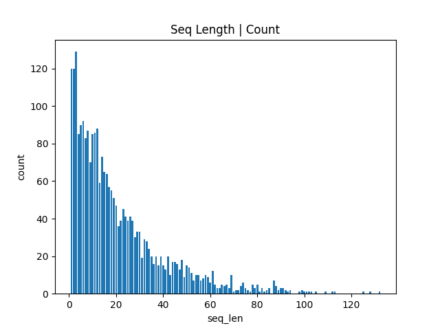
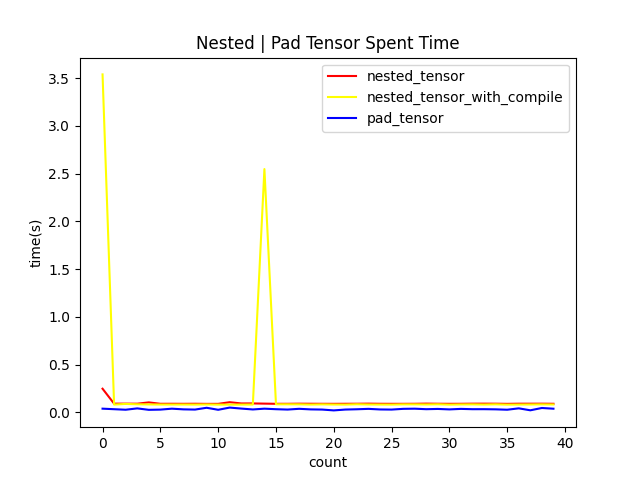
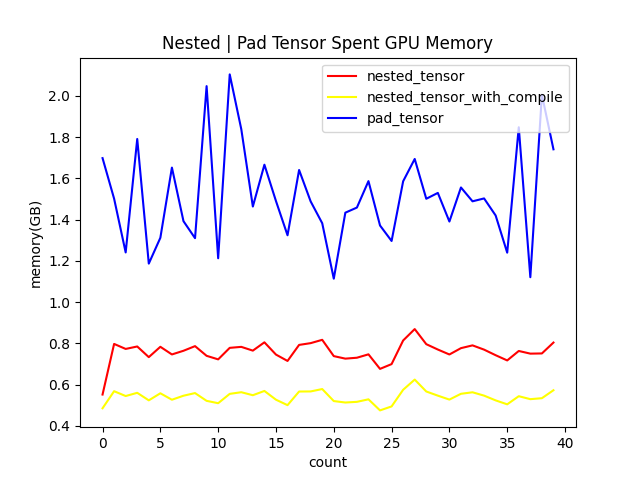

# MiniKL
`tokenizer`, `model`, `data`都由`PyTorch`从零实现，不包含其他库，如`transformers`,`deepspeed`。  
支持混合精度训练、 分布式数据并行。   

## 依赖包安装
```commandline
pip install -r requirements.txt
```
## 预训练脚本
预训练需要提供词表(JSON文件)和预训练数据集(JSONL文件)。
提供测试的放在 https://www.modelscope.cn/datasets/kkyyxhll/MiniKL-dataset/files 中。
- vocab_dict.json 为词表文件
- data0.jsonl 为mini版本的预训练数据集
这两个参数需要在命令行的 `vocab_dict_path`和 `data_jsonl_path`中显式给出。

下面假设词表绝对路径为 `/home/kkyyxhll/Projects/PythonProjects/MiniKL/tokenizer/out_dir/vocab_dict.json`
预训练数据集绝对路径为 `/home/kkyyxhll/Projects/PythonProjects/MiniKL/data/out/data0.jsonl`
实际替换对应的词表路径和预训练数据集路径。
单机单卡  
```commandline
 torchrun --nnodes=1 --nproc-per-node=1 train/train_pretrain.py --vocab_dict_path="/home/kkyyxhll/Projects/PythonProjects/MiniKL/tokenizer/out_dir/vocab_dict.json"
 --data_jsonl_path=/home/kkyyxhll/Projects/PythonProjects/MiniKL/data/out/data0.jsonl
```
如果要使用`wandb`监控，命令例子如下，具体参见 https://wandb.ai/site :  
```commandline
torchrun --nnodes=1 --nproc-per-node=1 train/train_pretrain.py --use_wandb --wandb_entity=loukang --wandb_project=test  --vocab_dict_path="/home/kkyyxhll/Projects/PythonProjects/MiniKL/tokenizer/out_dir/vocab_dict.json"
 --data_jsonl_path=/home/kkyyxhll/Projects/PythonProjects/MiniKL/data/out/data0.jsonl
```
`wandb_entity`和`wandb_project`对应
```commandline
run = wandb.init(entity=args.wandb_entity,
                         # Set the wandb project where this run will be logged.
                         project=args.project,
                         # Track hyperparameters and run metadata.
                         config={
                             "learning_rate": args.lr,
                             "architecture": "MiniKL Decoder",
                             "dataset": "books",
                             "epochs": args.epochs,
                             "batch_size": args.batch_size
                         }, )
```
单机多卡， 同单机单卡，只是`nproc-per-node` 不同。
```commandline
 torchrun --nnodes=1 --nproc-per-node=n train/train_pretrain.py 
```

## 测试脚本
- vocab_dict_path: 对应词表json文件路径，如`/home/kkyyxhll/Projects/PythonProjects/MiniKL/tokenizer/out_dir/vocab_dict.json`
- model_path: 对应预训练模型路径，如`/home/kkyyxhll/Projects/PythonProjects/MiniKL/pretrain_model.pth`
- prompt: 对应用户输入
下面是一个例子
```commandline
python test.py --vocab_dict_path=/home/kkyyxhll/Projects/PythonProjects/MiniKL/tokenizer/out_dir/vocab_dict.json 
--model_path=/home/kkyyxhll/Projects/PythonProjects/MiniKL/pretrain_model.pth --prompt="一生一代一双人,"
```

## Nested Tensor 测试记录
传统数据处理，需要将`seq_len`固定在同一维度，即`(batch_size, seq_len, d_model)`。  
通常需要**补短截长**，短`seq`的后面加上`<pad>`，需要一个额外的`loss_mask`序列，  
然后在最后计算`Loss`的时候对于`loss_mask=0`处不计算`loss`。
而`Nested Tensor`的提出就是为了解决这一问题，可以处理变长序列。
`Nested Tensor`目前不支持`GQA`,仅支持`MHA`。  
测试性能过程中，通过`zipf`定律生成真实随机变长序列，然后记录性能结果。
```python
    import torch 
    import timeit 
    def benchmark(func, *args, **kwargs):
        torch.cuda.synchronize()
        torch.cuda.reset_peak_memory_stats()
        begin = timeit.default_timer()
        output = func(*args, **kwargs)
        torch.cuda.synchronize()
        end = timeit.default_timer()
        return (end - begin), torch.cuda.max_memory_allocated() / 1e9
```
测试参数如下:
```commandline
d_model: int = 512,  # 模型隐层维度
theta: float = float(1e6),  # RoPE base
num_heads: int = 8,  # attention层头数
g: int = 8,  # g=1 MQA 1<g<num_heads GQA g=num_heads MHA
ffn: str = "GLU",  # "GLU" | "FFN" FFN为标准Transformer的FFN， GLU为门控线性单元，默认GLU。
num_layers: int = 4,
flag_kv_cache: bool = False,  # 是否推理
vocab_size: int = 5000,
is_nested: bool = False, # 是否使用嵌套张量
```
通过`zipf`定律生成的数据长度分布图如下：

测试结果如下图所示:


可以看到对于GPU内存来说，nested_tensor显著下降。
而时间确是nested_tensor较慢一些，原因有
1. 因为自己实现的RoPE，在RoPE适配NestedTensor时，需要循环遍历，导致时间较长。  
```commandline
values = torch.rand(x.size(1), 0, x.size(-1)).to(x.device)
            for nt in x:
                rope_nt = nt * self.rope_cos[:nt.size(-2), :] + torch.stack([nt[..., 1::2], -nt[..., 0::2]], dim=-1).flatten(-2, -1)*self.rope_sin[:nt.size(-2),:]
                values = torch.cat([values, rope_nt], dim=-2)
            output = torch.nested.nested_tensor_from_jagged(values=values, offsets=x.offsets(), jagged_dim=2)
```
2. 只记录了`forward`阶段的比较，最终PadTensor还有`mask_loss`的耗时。  